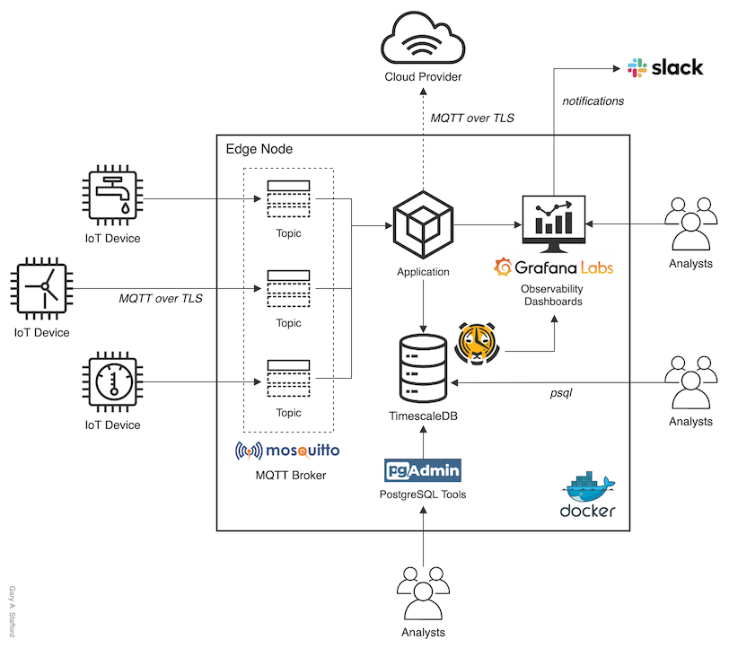

# GTM Stack: IoT Data Analytics at the Edge

## Exploring the convergence of IoT, Data Analytics, and Edge Computing with Grafana, Mosquitto, and TimescaleDB on ARM-based devices

Source code for the post, [GTM Stack: IoT Data Analytics at the Edge](https://medium.com/codex/gtm-stack-iot-data-analytics-at-the-edge-a935db85ee28).

Explore the integration of several open source applications to build an IoT edge analytics stack designed to operate on low-cost, ARM-based edge nodes. We will use the stack to collect, analyze, and visualize IoT data without first shipping the data to the Cloud or other external systems.
  
This branch contains a revised version of the earlier main branch, featuring major version updates of TimescaleDB (v1.7.4-pg12 to v2.0.0-pg12), Grafana (v7.1.5 to v7.5.2), and Mosquitto (v1.6.12 to v2.0.9). All source code and SQL scripts are revised. Note that TimeScaleDB has a current limitation/bug with Docker on ARM later than v2.0.0.

## GTM Stack Architecture

