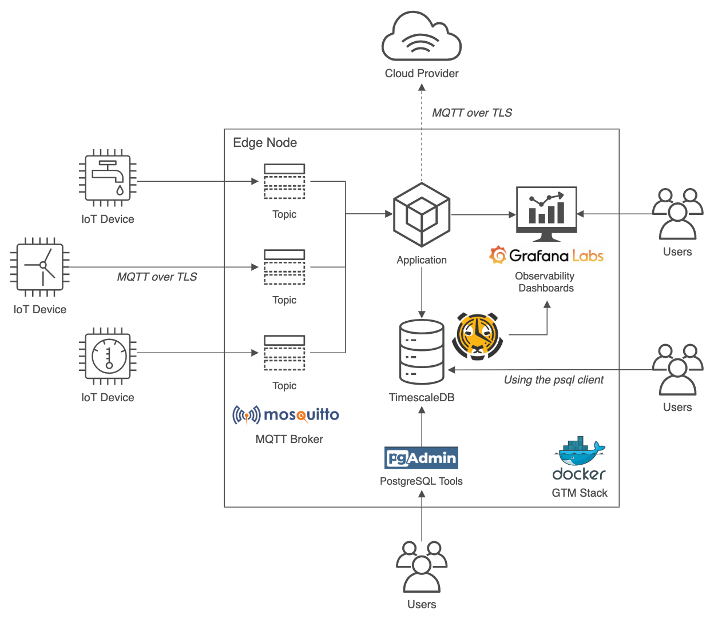

# GTM Stack: IoT Data Analytics at the Edge

## Exploring IoT Data Analytics at the Edge with Mosquitto, TimescaleDB, and Grafana, on ARM-based Architecture

Source code for the post, [GTM Stack: IoT Data Analytics at the Edge](https://medium.com/@GaryStafford/iot-data-analytics-at-the-edge-d116b6681d7b).

In the post, we explore the integration of several open-source software applications to build an IoT edge analytics stack, designed to operate on ARM-based edge nodes. We use the stack to collect, analyze, and visualize IoT data, without first shipping the data to Cloud or other external systems. See the post for complete instructions on using the source code.

## Architecture

